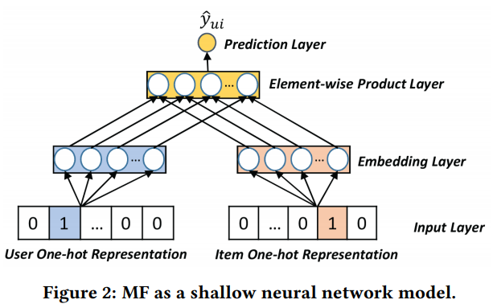

##### 文章简介：

> information-oriented和social oriented，前者指的是论坛或者电子商务网站，强调user-item的交互关系。后者指的是社交网络服务（social networking services）有丰富的user-user关系。首先不管他们的异质性，这两个网络可以用一些重叠的用户建立联系。这些用户称为bridge users。这篇文章着重解决跨域的社会推荐（cross-domain social recommendation），例如推荐相关的物品或者信息给社交网络中国潜在的人群。

> To our knowledge, this is a new problem that has rarely been studied before.（具体问题见问题定义部分）

> 现有的cross-domain recommender system对于这个问题不适用，因为它们要么关注同构信息域，要么假设用户是完全重叠的。文中提出了一个新的Neural Social Collaborative Ranking（NSCR）方法，无缝连接了user-item交互关系和user-user的连接关系。在信息领域部分，用户和item的属性被利用来加强user和item的嵌入表示。在SNS part，bridge user的embedding被传播来学习其他non-bridge users的embedding。

##### 文中讲到的贡献有什么呢？

> 1. 首次引入cross-domain social recommendation的任务，来推荐information domain的item给social domain的目标用户；
> 2. 利用了deep neural network提出解决方案建模含有属性的user-item交互关系，利用图拉普拉斯建模user-user的社交关系；
> 3. 构造了两个真实网络数据集，探究cross-domain social recommendation任务，并且对提出的模型进行评估。

##### 文中问题描述和问题定义？

> 
>
> 首先利用$u$和$\mathcal{U}_{1}=\left\{u_{t}\right\}_{t=1}^{M_{1}}$来表示一个用户和在information domain的所有用户的集合。用$i$h和$I=\left\{i_{t}\right\}_{t=1}^{N}$来表示一个item和 所有item集合。user和item之间的关系用$\mathcal{Y}=\left\{y_{u i}\right\}$来表示。另外user和item可能还根据场景不同带有一定的属性信息$attributes$。用$g$和$\mathcal{G}=\left\{g_{t}\right\}_{t=1}^{V}$来表示一个属性和所有的属性集合。所以对于用户来讲，相关的属性集合可以用$\mathcal{G}_{u}=\left\{g_{1}^{u}, \cdots, g_{V_{u}}^{u}\right\}$来表示，对于item来讲，相关的属性集合可以用$\mathcal{G}_{i}=\left\{g_{1}^{i}, \cdots, g_{V_{i}}^{i}\right\}$来表示。
>
> 其次，在social domain，用$u'$来表示social user，所有的social domain中的用户集合用$\mathcal{U}_{2}=\left\{u_{t}^{\prime}\right\}_{t=1}^{M_{2}}$表示。所有的社交关系表示为$\mathcal{S}=\left\{s_{u^{\prime} u^{\prime \prime}}\right\}$，则根据上面定义，bridge用户可以用$\mathcal{U}=\mathcal{U}_{1} \cap \mathcal{U}_{2}$来表示。
>
> 最终，问题定义如下：
>
> **输入：**information domain的$\left\{\mathcal{U}_{1}, I, \mathcal{Y}, \mathcal{G}_{u}, \mathcal{G}_{i}\right\}$；social domain中的$\left\{\mathcal{U}_{2}, \mathcal{S}\right\}$；其中$\mathcal{U}_{1} \cap \mathcal{U}_{2}$是非空集合；
>
> **输出：**对每个social domain中的用户$u'$，有一个个性化的排序函数，函数$f_{u^{\prime}}: I \rightarrow \mathbb{R}$把每个information domain中的item映射为实数。

##### 协同过滤的简介和存在的问题？

> 协同过滤是个性化推荐中的关键技术，通过假设相类似的用户可能在item domain中有类似的兴趣偏好，来探究user-item的关系。基于模型的协同过滤通过一个底层模型来描述user-item之间的关系，来实现上述假设。整体目标就是$\widehat{y}_{u i}=f_{\Theta}(u, i)$，可以看到是用一个函数（模型）计算user和item的关系。在诸多模型中，**矩阵分解**是最简单有效的方法之一，通过把user和item表示成一个隐式的向量，建模 user-item的关系为两个隐向量内积的形式，如$f_{M F}\left(u, i | \mathbf{p}_{u}, \mathbf{q}_{i}\right)=\mathbf{p}_{u}^{\top} \mathbf{q}_{i}=\sum_{k=1}^{K} p_{u k} q_{i k}$，其中$\mathbf{p}_{u}, \mathbf{q}_{i}$就是user和item的隐向量表示。
>
> 矩阵分解的表达能力，会被用向量内积来建模user-item交互关系所限制。为什么呢？矩阵分解本质是把user和item表示成one-hot的向量，然后通过一系列的分解表示，得到user和item的最终向量；最终再使用user和item的隐向量进行乘积得到输出结果，用一个**浅层的**神经网络框架可以模拟，如下图。
>
> 
>
> 所以，基于矩阵分解和神经网络的这种联系，文中提出MF-based方法来解决cross-domain social recommendation任务有两个**缺陷**：
>
> 1. MF仅简单考虑了user和item的交互，而假设user和item的隐向量表示$\mathbf{p}_{u}, \mathbf{q}_{i}$是相互独立的。这种独立性假设不足以描述真实世界的数据，真实数据中user和item之间的关系往往非常复杂，而且存在非线性结构。
> 2. 如果我们把属性信息也考虑在内的话，会更加不理想。一个用side information扩展MF的经典方法就是SVDfeature。该方法通过user、item的embedding vector与attribute embedding vector相加。然而，这忽略了用户之间的潜在关系，属性的信息也不可避免的被忽略。

##### 继续说一下MF的缺陷

> cross-domain social recommendation的目标是为social users从information domain中选择相关的items。在基于嵌入表示的方法框架下，解决这个任务的关键就是如何把item（information domain）和user（social domain）映射到统一个嵌入空间。一般的解决方法是MF，对两个domain中的数据进行早期融合。具体的是，通过结合social users作为输入的特征构造预测模型。然而这种方法只能对bridge user有用，当user既在social domain中有信息，又在information domain中有信息的情况在真实场景中是很少的。所以传统的MF方法会受到bridge user不足的限制。

##### 文中提出的方法（Neural Social Collaborative Ranking，NSCR)

> 为了解决bridge user不足的问题，文中提出了一个框架，把不同domain的embedding learning分开，然后强制两个部分对于bridge user有相同的embedding vector，此时可以保证user embedding和item embedding在同一个空间中，优化函数如下（把information domain和social  domain的损失加和）：
> $$
> \mathcal{L}=\mathcal{L}_{I}\left(\Theta_{I}\right)+\mathcal{L}_{S}\left(\Theta_{S}\right)
> $$
>
> ##### 首先是information domain中的学习：
>
> point-wise和pair-wise两类目标函数是最常用的。point-wise目标函数主要是最小化预测值和目标值的损失。pair-wise目标函数是通过一对正反样例进行比较，通常正例的值要大于负例的值，关注的是数值排列的顺序。文中使用的是regression-based ranking loss：$\mathcal{L}_{I}=\sum_{(u, i, j) \in O} \mathcal{L}\left(y_{u i j}, \hat{y}_{u i j}\right)$。预测值对之间的差别跟真实值对之间的差别的差。但是真实值使用的负反馈，只有0/1的值，所以：
> $$
> \mathcal{L}_{I}=\sum_{(u, i, j) \in O}\left(y_{u i j}-\hat{y}_{u i j}\right)^{2}=\sum_{(u, i, j) \in O}\left(\hat{y}_{u i}-\hat{y}_{u j}-1\right)^{2}
> $$
>
> ##### 属性感知的深度CF模型：
>
> **输入层**：user、item、属性的one-hot编码；
>
> **嵌入层**：把one-hot编码映射成密集的向量表示（dense vector representation）；
>
> **池化层**：由于不同的user和item可能会有不同数量的属性（属性不应该都是统一的，没值的padding 0不可以么？为什么会有不同数量的属性？），此部分就是把user和item表示成固定长度的向量。
>
> 简单的pooling应该是average pooling或者max pooling，但是这些方法不足以表达user、item和属性之间的关系。比如average pooling假设user和属性之间是线性无关的，这个不能表示他们在嵌入空间的关系。所以，文中提出了一种pooling 方法pairwise pooling，从因子分解机中获得的启发：
> $$
> \mathbf{p}_{u}=\varphi_{\text {pairwise}}\left(\mathbf{u},\left\{\mathbf{g}_{t}^{u}\right\}\right)=\sum_{t=1}^{V_{u}} \mathbf{u} \odot \mathbf{g}_{t}^{u}+\sum_{t=1}^{V_{u}} \sum_{t^{\prime}=t+1}^{V_{u}} \mathbf{g}_{t}^{u} \odot \mathbf{g}_{t^{\prime}}^{u}
> $$
> 对item来说也是一样：
> $$
> \mathbf{q}_{i}=\varphi_{\text {pairwise}}\left(\mathbf{i},\left\{\mathbf{g}_{t}^{i}\right\}\right)=\sum_{t=1}^{V_{i}} \mathbf{i} \odot \mathrm{g}_{t}^{i}+\sum_{t=1}^{V_{i}} \sum_{t^{\prime}=t+1}^{V_{i}} \mathbf{g}_{t}^{i} \odot \mathrm{g}_{t^{\prime}}^{i}
> $$
> 值得注意的是，虽然pairwise pooling是要成对计算，但是还是可以在线性时间计算出来，跟max、average pooling一样哦，公式3可以重写一下：
> $$
> \mathbf{p}_{u}=\frac{1}{2}\left[\left(\mathbf{u}+\sum_{t=1}^{V_{u}} \mathbf{g}_{t}^{u}\right) \odot\left(\mathbf{u}+\sum_{t=1}^{V_{u}} \mathbf{g}_{t}^{u}\right)-\mathbf{u} \odot \mathbf{u}-\sum_{t=1}^{V_{u}} \mathbf{g}_{t}^{u} \odot \mathbf{g}_{t}^{u}\right]
> $$
> **隐藏层**：在pairwise pooling层之上，堆叠一些全连接层学习非线性关系和高阶关联关系。从神经网络的角度去看MF，首先文中把$\mathbf{p}_u$和item的表示$\mathbf{q}_i$按元素乘积，目的是建模user和item的双向交互关系。然后放了在此基础上放了一个MLP，具体公式如下：
> $$
> \left\{\begin{array}{l}
> \mathbf{e}_{1}=\sigma_{1}\left(\mathbf{W}_{1}\left(\mathbf{p}_{u} \odot \mathbf{q}_{i}\right)+\mathbf{b}_{1}\right) \\
> \mathbf{e}_{2}=\sigma_{2}\left(\mathbf{W}_{2} \mathbf{e}_{1}+\mathbf{b}_{2}\right) \\
> \cdots \cdots \\
> \mathbf{e}_{L}=\sigma_{L}\left(\mathbf{W}_{L} \mathbf{e}_{L-1}+\mathbf{b}_{L}\right)
> \end{array}\right.
> $$
> **预测层**：文中没有使用user和item隐向量的乘积，因为在隐藏层这俩已经乘起来了。所以，在此处，只是简单的在最终的输出上面乘了权重：
> $$
> \hat{y}_{u i}=\mathbf{w}^{\top} \mathbf{e}_{L}
> $$
> 
>
> ##### social domain的嵌入学习
>
> 在以上的神经协同过滤排序方案中，我们得到了属性感知的user和item的表示$\mathbf{p}_{u}$和$\mathbf{q}_{i}$。为了预测social user对item在information domain中的亲密程度，我们同样需要在相同的隐式空间内学习social user的表示。通过从bridge user开始传播$\mathbf{p}_{u}$，来表示social domain中的non-bridge user。此部分的假设是：如果两个用户之间存在强关系，那么他们俩在item上存在相似的兴趣偏好。也就是说它们在因空间中应该有相似的向量表示，这个也很符合图正则化理论，graph regularization中有两部分：
>
> **平滑：**具有连接的两个用户的向量表示不应该存在巨大的差异。所以在social domain learning部分，执行平滑约束将把user的表示传播给它的邻居，直到稳定，所有的节点都已经在相同的隐式空间内有embedding。平滑约束的目标函数如下：
> $$
> \theta\left(\mathcal{U}_{2}\right)=\frac{1}{2} \sum_{u^{\prime}, u^{\prime \prime} \in \mathcal{U}_{2}} s_{u^{\prime} u^{\prime \prime}}\left\|\frac{\mathbf{p} u^{\prime}}{\sqrt{d_{u^{\prime}}}}-\frac{\mathbf{p} u^{\prime \prime}}{\sqrt{d_{u^{\prime \prime}}}}\right\|^{2}
> $$
> $d_{u'}$代表节点的度，$s_{u'u''}$代表节点间的连接强度。值得注意的是，这里用了归一化，这是与social regularization不同的关键点，social regularization中在平滑约束上没有用任何的归一化。而以往的研究指出，归一化可以提高模型的性能。
>
> **Fitting**：适配约束指的是隐式空间在两个domain中的一致性，即bridge user的embedding应该是不变的，充当cross-domain的anchor。对此，对于不同domain中的同一个bridge user应该有近似的表示。目标函数如下：
> $$
> \theta(\mathcal{U})=\frac{1}{2} \sum_{u^{\prime} \in \mathcal{U}}\left\|\mathrm{p}_{u^{\prime}}-\mathrm{p}_{u^{\prime}}^{(0)}\right\|^{2}
> $$
> 最终social domain的目标函数如下：
> $$
> $$\mathcal{L}_{S}=\theta\left(\mathcal{U}_{2}\right)+\mu \theta(\mathcal{U})
> $$
> **预测层：**跟information domain中的基本一致，先把user和item的向量表示乘起来，然后通过MLP，最终再在输出的embedding上加权重，输出预测结果：
> $$
> \left\{\begin{array}{l}
> \mathbf{e}_{1}=\sigma_{1}\left(\mathbf{W}_{1}\left(\mathbf{p}_{u^{\prime}} \odot \mathbf{q}_{i}\right)+\mathbf{b}_{1}\right) \\
> \cdots \cdots \\
> \mathbf{e}_{L}=\sigma_{L}\left(\mathbf{W}_{L} \mathbf{e}_{L-1}+\mathbf{b}_{L}\right) \\
> \widehat{y}_{u^{\prime}} i=\mathbf{w}^{\top} \mathbf{e}_{L}
> \end{array}\right.
> $$
>
> ##### 训练
>
> 在information domain中，使用随机梯度下降SGD进行训练。在social domain中，通过输入bridge user的embedding近图拉普拉斯算子中，来更新所有的social user的embedding。